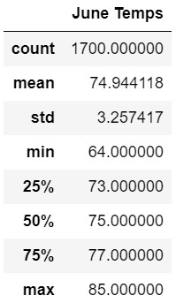
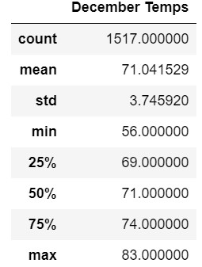

# Challenge Module- 9
## Surfs Up with Advanced Data Storage And Retrieval

## Module 9 Challenge

### Overview
"While on vacation in Hawaii last year, you discovered a newfound passion for surfing. You've been trying to create a plan that will let you not just return to Hawaii, but live there forever. You finally come up with an idea that you think is foolproof, a Surf and Shake shop serving surfboards and ice cream to locals, tourists, and of course, yourself.

You have some savings you're willing to invest, but we'll need some real investor backing to get this off the ground. So after putting together a strong business plan, you reach out to an investor, W. Avy, who is famous for his love of surfing. Your first meeting with him goes extremely well, but he has one concern, what about the weather?

He's extremely serious about this. He invested in a surf shop early in his career. However, he didn't ask for any weather analysis and that early venture was rained out of existence. W. Avy knows you've been learning how to properly analyze data and asks if you can run some analytics on a weather data set he has from the very island where you'd like to open your shop, the beautiful Awahoo." (from Module Section 9.0.4)

" 
* Deliverable 1: Determine the Summary Statistics for June
* Deliverable 2: Determine the Summary Statistics for December
* Deliverable 3: A written report for the statistical analysis" (from Module Challenge Page)

### Results
Screen shots of the data used in this section are below the written response.  The minimum temperature, maximum temperature and the variance of the mean temperature variance seen in the results is not as high as one would expect throughout the continental US.  

* The mean temperature for December is 71.04° F compared to June at 74.94° F with a difference of 3.9° F
* The minimum temperature for December is 56° F compared to June at 64° F with a difference of 8° F
* The maximum temperature for December is 83° F compared to June at 85° F with a difference of 2° F
* The number of days measured for December is 1517 compared to June at 1700 with a difference of 183 or 12.06%

### Summary
Given the similarity in the overall variance in temperatures the data does not suggest there would be a defined slow season based solely on weather.  The average temperature for both June and December is in the 70's.  The high temperature is only 2° F different, and the low temperature is only different by 8° F.  However, in my personal opinion they is a mental divide in seeing temperatures in the 50's vs the 60's, so there could be a point that even though the actual change in the temperatures is not great its impact on people visiting a Surf and Shake shop could be.  The main difference from the data that sticks out is the number of days monitored.  December has 1 more day than June but it returned 12% less results.  It is unknown why the difference exists but it is possible that excluding days that were missed from the December data from the June data could alter the variances in temperatures.  Other information to look at in developing the business model could be the amount of precipitation per month, and though not included in this data set, the total hours of sunlight per day.  The logic in examining these two factors is that both might not stop people from visiting the Island but would impact the amount of traffic received at the shop.  If December proves to have much higher precipitation than June in might influence the shop closing for the season.  The number of hours of day light could impact how early or late the shop is open.  Other more broad data would help in driving the business plan for the shop such as number of visitors to the Island per day, and widening the months reviewed to include all months in the year to see if more discernable patterns present themselves.  
